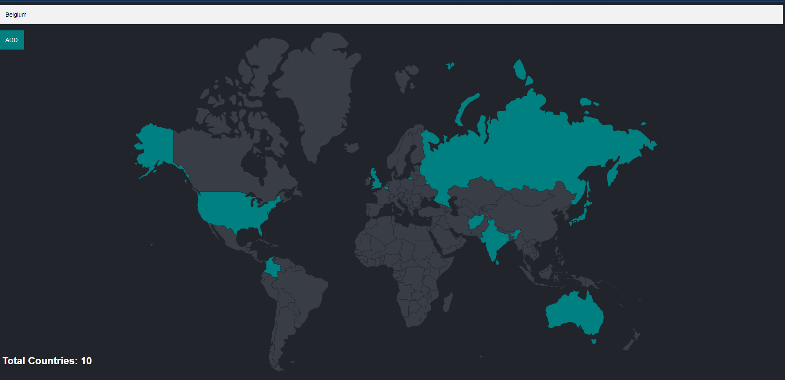

# Travel Tracker

### Project Overview

**Travel Tracker** is a web application designed to help you keep track of the countries you have visited. The application is built using ```Node.js```, ```Express.js```, ```EJS```, and ```PostgreSQL```, providing to manage our travel history.

### To Install Dependencies

```
npm i 

or

npm install
```

## Necessary NPM Packages or Dependencies

* Postgre SQL (Pg) => [pg](https://www.npmjs.com/package/pg)

* EJS (Embedded Javascript => [ejs](https://www.npmjs.com/package/ejs).

* Express => [express](https://www.npmjs.com/package/express).

* Body-parser => [body-parser](https://www.npmjs.com/package/body-parser)

## Features

* **Track Visits:** Add and view countries you have visited.


### Technologies Used

* **Node.js:**  Backend runtime environment.
* **Express.js:**  Web framework for Node.js.
* **EJS:** Templating engine for rendering HTML.
* **Postgre SQL:**  Advanced, enterprise-class, and open-source relational database system.
* **CSS:**  Styling the webpage.

### Prerequisites

* Node.js (v12.x or higher)
* npm (Node Package Manager)
* Postgre SQL

### Set up the PostgreSQL database

- Ensure PostgreSQL is installed and running.
- Create a database for the project.
- Set up the database schema

### To start the server 

```
nodemon server.js 

or

node server.js
```

##### Open in Browser

Open your browser and navigate to ```http://localhost:3000``` to view the application.

## Screenshots



## License 

This project is licensed under the MIT License - see the [MIT](https://choosealicense.com/licenses/mit/) License file for details.
